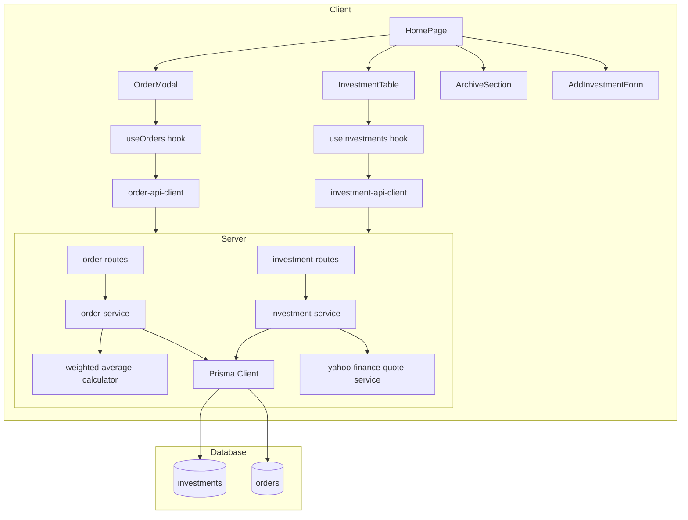
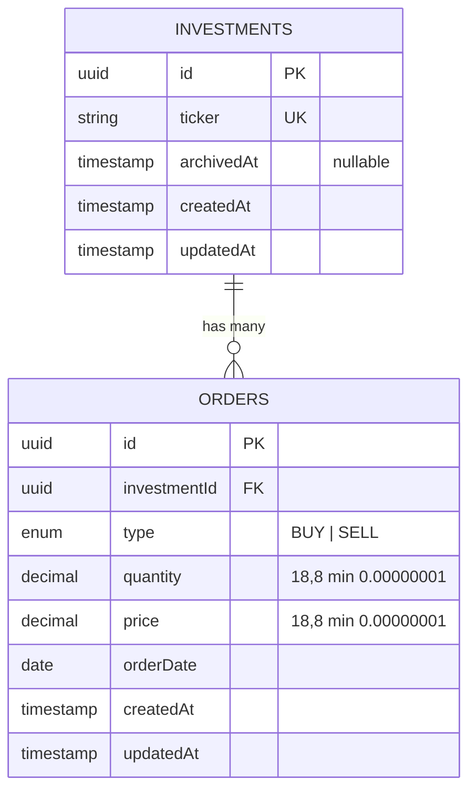

# Design Document: Order Management v2

## Overview

This design transforms the Finance Investment Manager from a manual quantity/average-price model into an order-based system. Instead of users typing in portfolio values directly, they register tickers and log individual buy/sell orders. The system computes position quantity and weighted average price (preço médio ponderado) on-the-fly from the order history.

Key architectural changes:
- New `orders` table with a foreign key to `investments`
- `quantity` and `averagePrice` columns removed from `investments`; replaced by computed values derived from associated orders
- Hard-delete replaced with soft-delete via `archivedAt` timestamp
- PUT endpoint removed (ticker is immutable, position is order-derived)
- New dedicated order service with the weighted average calculation logic as a pure function

The implementation is clean-slate — no v1 data migration, fresh database migration.

## Architecture



### Server Layer Changes

```
Routes
├── investment-routes.ts  (POST, GET, PATCH /archive, removed PUT)
├── order-routes.ts       (POST /api/investments/:id/orders, GET /api/investments/:id/orders)

Services
├── investment-service.ts (listActive, listArchived, create, archive — no update)
├── order-service.ts      (createOrder, listOrders, computePosition)
├── weighted-average-calculator.ts (pure function — preço médio ponderado logic)
├── yahoo-finance-quote-service.ts (unchanged)

Validators
├── investment-validator.ts (simplified: ticker-only)
├── order-validator.ts      (new: type, quantity, price, orderDate)
```

### Client Layer Changes

```
Pages
├── HomePage.tsx (orchestrates all modals, manages active/archive views)

Components
├── InvestmentTable.tsx      (active investments, computed columns)
├── AddInvestmentForm.tsx    (ticker-only form, replaces InvestmentFormModal)
├── OrderModal.tsx           (add order form + order history list)
├── ArchiveSection.tsx       (archived investments with expandable order history)
├── ArchiveConfirmDialog.tsx (replaces DeleteConfirmationDialog)

Hooks
├── useInvestments.ts  (listActive, listArchived, create, archive mutations)
├── useOrders.ts       (listOrders, createOrder mutations)

Lib
├── investment-calculator.ts (unchanged pure calculation functions)

Services
├── investment-api-client.ts (updated endpoints)
├── order-api-client.ts      (new)
```

## Components and Interfaces

### API Endpoints (v2)

| Method | Path | Description |
|--------|------|-------------|
| GET | `/api/investments` | List active investments (enriched with computed position + quotes) |
| GET | `/api/investments/archived` | List archived investments with final position |
| POST | `/api/investments` | Create investment (ticker-only) |
| PATCH | `/api/investments/:id/archive` | Soft-delete (set archivedAt) |
| GET | `/api/investments/:id/orders` | List orders for investment |
| POST | `/api/investments/:id/orders` | Create order for investment |
| GET | `/health` | Health check |
| POST | `/api/test/reset` | Dev/test only — wipes DB |

### Server Interfaces

```typescript
// --- Investment Types ---

interface CreateInvestmentInput {
  ticker: string; // trimmed, uppercased, 1-10 chars, letters/digits/dots only
}

interface InvestmentRecord {
  id: string;
  ticker: string;
  archivedAt: string | null;
  createdAt: string;
  updatedAt: string;
}

interface ComputedPosition {
  quantity: string;        // Decimal string
  averagePrice: string;   // Decimal string
}

interface EnrichedInvestment extends InvestmentRecord {
  position: ComputedPosition;
  quote: MarketQuote | null;
}

interface ArchivedInvestment extends InvestmentRecord {
  position: ComputedPosition;
}

// --- Order Types ---

type OrderType = 'BUY' | 'SELL';

interface CreateOrderInput {
  type: OrderType;
  quantity: number;   // > 0
  price: number;      // > 0
  orderDate: string;  // ISO date, not in the future
}

interface OrderRecord {
  id: string;
  investmentId: string;
  type: OrderType;
  quantity: string;   // Decimal string
  price: string;      // Decimal string
  orderDate: string;  // ISO date
  createdAt: string;
  updatedAt: string;
}
```

### Weighted Average Calculator (Pure Function)

```typescript
interface PositionState {
  quantity: number;
  averagePrice: number;
}

interface OrderEntry {
  type: OrderType;
  quantity: number;
  price: number;
}

/**
 * Computes the running position from a chronological sequence of orders.
 * Uses the Brazilian "preço médio ponderado" method:
 * - BUY: newAvg = (prevQty × prevAvg + orderQty × orderPrice) / (prevQty + orderQty)
 * - SELL: reduces quantity, average price unchanged
 * - If position reaches zero, average price resets to zero
 * - Next BUY after zero position sets average to the order price
 *
 * Results are rounded to 8 decimal places.
 */
function computePosition(orders: OrderEntry[]): PositionState;
```

### Client Interfaces

```typescript
// --- Form Data ---

interface AddInvestmentFormData {
  ticker: string;
}

interface AddOrderFormData {
  type: OrderType;
  quantity: number;
  price: number;
  orderDate: Date;
}

// --- API Response Types ---

interface InvestmentListItem {
  id: string;
  ticker: string;
  quantity: string;
  averagePrice: string;
  archivedAt: string | null;
  createdAt: string;
  updatedAt: string;
  quote: MarketQuote | null;
}

interface OrderListItem {
  id: string;
  type: OrderType;
  quantity: string;
  price: string;
  orderDate: string;
  createdAt: string;
}
```

### Zod Validators

```typescript
// Server: investment-validator.ts
const createInvestmentSchema = z.object({
  ticker: z.string()
    .trim()
    .min(1, 'ticker must not be empty')
    .max(10, 'ticker must be at most 10 characters')
    .regex(/^[A-Za-z0-9.]+$/, 'ticker must contain only letters, digits, and dots')
    .transform(v => v.toUpperCase()),
});

// Server: order-validator.ts
const createOrderSchema = z.object({
  type: z.enum(['BUY', 'SELL']),
  quantity: z.number().positive('quantity must be greater than 0'),
  price: z.number().positive('price must be greater than 0'),
  orderDate: z.string()
    .date()
    .refine(d => new Date(d) <= new Date(), 'order date must not be in the future'),
});
```

## Data Models

### Prisma Schema (v2)

```prisma
model Investment {
  id         String    @id @default(uuid())
  ticker     String    @unique
  archivedAt DateTime?
  createdAt  DateTime  @default(now())
  updatedAt  DateTime  @updatedAt
  orders     Order[]

  @@map("investments")
}

model Order {
  id           String   @id @default(uuid())
  investment   Investment @relation(fields: [investmentId], references: [id], onDelete: Restrict)
  investmentId String
  type         OrderType
  quantity     Decimal  @db.Decimal(18, 8)
  price        Decimal  @db.Decimal(18, 8)
  orderDate    DateTime @db.Date
  createdAt    DateTime @default(now())
  updatedAt    DateTime @updatedAt

  @@map("orders")
}

enum OrderType {
  BUY
  SELL
}
```

### Entity Relationship



### Key Data Rules

1. **Ticker uniqueness**: Enforced at DB level with `@unique` constraint and validated in service layer before insert
2. **ON DELETE RESTRICT**: Orders prevent deletion of their parent investment — archive is the only removal path
3. **Computed position**: Never stored; always derived from orders at query time via `computePosition()`
4. **Soft-delete**: `archivedAt IS NULL` filter on all "active" queries; archived records remain queryable through dedicated endpoint
5. **Decimal precision**: All monetary/quantity fields use Decimal(18,8) to avoid floating-point drift; API serializes as strings
6. **Order date**: Stored as date-only (no time component); defaults to today on the client; validated server-side to not be in the future

## Correctness Properties

### Property 1: Ticker validation round-trip
**Validates: Requirements 1.1, 1.3, 1.5**

### Property 2: Order numeric validation rejects non-positive values
**Validates: Requirements 2.5, 2.6, 3.4**

### Property 3: Weighted average computation correctness
**Validates: Requirements 4.1, 4.6**

### Property 4: Sell preserves weighted average price
**Validates: Requirements 4.2**

### Property 5: Quantity invariant
**Validates: Requirements 4.4, 3.2**

### Property 6: Sell exceeding position is rejected
**Validates: Requirements 3.1, 4.3**

### Property 7: Computation determinism (sequential equals batch)
**Validates: Requirements 4.7**

### Property 8: Zero position resets average to zero
**Validates: Requirements 4.5**

### Property 9: Order sort descending by date with tiebreaker
**Validates: Requirements 5.1**

### Property 10: Active listing excludes archived investments
**Validates: Requirements 7.4, 8.5**

## Error Handling

### Server-Side Errors

| Scenario | HTTP Status | Response Shape |
|----------|-------------|----------------|
| Ticker validation fails | 400 | `{ error: "Validation failed", details: { ticker: [...] } }` |
| Duplicate ticker | 409 | `{ error: "Ticker \"ITUB3\" is already registered" }` |
| Order validation fails | 400 | `{ error: "Validation failed", details: { quantity: [...] } }` |
| Sell exceeds position | 422 | `{ error: "Sell quantity (150) exceeds available position (100)" }` |
| Investment not found | 404 | `{ error: "Investment with id \"...\" not found" }` |
| Investment already archived | 409 | `{ error: "Investment \"ITUB3\" is already archived" }` |
| PUT /api/investments/:id (removed) | 405 | `{ error: "PUT method not allowed. Investments are now order-derived and cannot be manually updated" }` |
| Investment has orders (hard delete attempt) | 409 | `{ error: "Cannot delete investment with existing orders. Use archive instead" }` |
| Unexpected server error | 500 | `{ error: "Internal server error" }` |

## Testing Strategy

### Property-Based Tests (Vitest + fast-check)
- `server/src/services/weighted-average-calculator.ts` — Properties 3–8
- `server/src/validators/investment-validator.ts` — Property 1
- `server/src/validators/order-validator.ts` — Property 2
- Sort utility for orders — Property 9
- Query filter logic — Property 10

### Unit Tests (Vitest)
- Weighted average calculator: specific known scenarios
- Investment service: mocked Prisma interactions
- Order service: mocked Prisma + sell validation

### Integration Tests (Vitest + Prisma test database)
- Full order lifecycle, archive flow, duplicate ticker, sell exceeding position, ON DELETE RESTRICT

### E2E Tests (Playwright)
- Add ticker, add BUY/SELL orders, archive investment, view order history, market data unavailable, removed PUT endpoint
