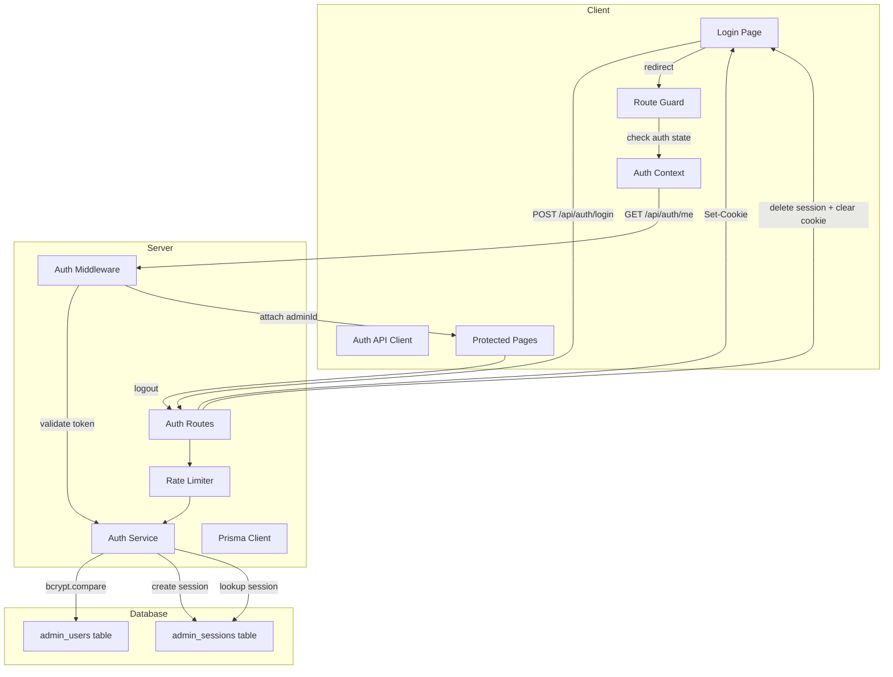

# Design Document: Admin Login

## Overview

This design adds authentication to the Finance Investment Manager — a single-user personal portfolio tracker. The implementation uses a pragmatic session-token approach: the admin authenticates with username/password, receives a cryptographically random session token stored in an httpOnly cookie, and all subsequent API requests are validated by an Express middleware.

The design intentionally avoids JWT complexity (no signing keys, no token refresh endpoints) in favor of opaque database-backed tokens, which are simpler to implement, trivial to revoke, and appropriate for a single-user application.

### Key Design Decisions

| Decision | Rationale |
|----------|-----------|
| Opaque token (not JWT) | Simpler revocation via DB delete; no signing key management; single-user doesn't benefit from stateless tokens |
| httpOnly cookie (not localStorage) | Immune to XSS token theft; browser auto-sends on every request |
| bcrypt for hashing | Industry standard, configurable cost factor, built-in salt |
| Sliding 7-day expiration | Balances security with usability for a personal tool used daily |
| Rate limiting in-memory | Simple Map-based approach; no Redis needed for single-instance deployment |
| Server sets cookie via Set-Cookie header | Client never touches the token directly — maximum security |

## Architecture



### Request Flow

```mermaid
sequenceDiagram
    participant Browser
    participant Express
    participant AuthMiddleware
    participant AuthService
    participant Database

    Note over Browser,Database: Login Flow
    Browser->>Express: POST /api/auth/login {username, password}
    Express->>AuthService: authenticate(username, password)
    AuthService->>Database: SELECT admin_users WHERE username
    AuthService->>AuthService: bcrypt.compare(password, hash)
    AuthService->>Database: INSERT admin_sessions (token, expiresAt)
    AuthService-->>Express: { token, adminId }
    Express-->>Browser: 200 + Set-Cookie: session=<token>; HttpOnly; Secure; SameSite=Strict

    Note over Browser,Database: Authenticated Request
    Browser->>Express: GET /api/investments (Cookie: session=<token>)
    Express->>AuthMiddleware: extract token from cookie
    AuthMiddleware->>AuthService: validateSession(token)
    AuthService->>Database: SELECT admin_sessions WHERE token AND expiresAt > now
    AuthService->>Database: UPDATE admin_sessions SET expiresAt = now + 7d
    AuthService-->>AuthMiddleware: { adminId }
    AuthMiddleware->>Express: req.adminId = adminId; next()
    Express-->>Browser: 200 [investment data]
```

## Components and Interfaces

### Server Components

#### 1. Auth Service (`server/src/services/auth-service.ts`)

Factory function following project conventions. Handles credential verification, session lifecycle, and rate limiting.

```typescript
interface AuthServiceDeps {
  db: PrismaClient;
}

interface LoginResult {
  token: string;
  adminId: string;
}

interface AuthService {
  authenticate(username: string, password: string, clientIp: string): Promise<LoginResult>;
  validateSession(token: string): Promise<{ adminId: string } | null>;
  invalidateSession(token: string): Promise<void>;
  isRateLimited(clientIp: string): boolean;
  recordFailedAttempt(clientIp: string): void;
  clearFailedAttempts(clientIp: string): void;
}

export function createAuthService(deps: AuthServiceDeps): AuthService;
```

#### 2. Auth Middleware (`server/src/middleware/auth-middleware.ts`)

Express middleware that extracts the session token from the cookie, validates it, and attaches the admin identity to the request.

```typescript
interface AuthMiddlewareDeps {
  authService: AuthService;
}

export function createAuthMiddleware(deps: AuthMiddlewareDeps): RequestHandler;
```

#### 3. Auth Routes (`server/src/routes/auth-routes.ts`)

Exposes login, logout, and session check endpoints.

```typescript
export function createAuthRouter(authService: AuthService): Router;
```

**Endpoints:**

| Method | Path | Auth | Description |
|--------|------|------|-------------|
| POST | `/api/auth/login` | No | Authenticate with credentials |
| POST | `/api/auth/logout` | Yes | Invalidate session + clear cookie |
| GET | `/api/auth/me` | Yes | Return current admin identity (session check) |

#### 4. Auth Validator (`server/src/validators/auth-validator.ts`)

Zod schemas for login input validation.

```typescript
import { z } from 'zod';

export const loginInputSchema = z.object({
  username: z.string().min(3).max(50),
  password: z.string().min(8).max(128),
});

export type LoginInput = z.infer<typeof loginInputSchema>;

export function validateLoginInput(data: unknown): { success: true; data: LoginInput } | { success: false; errors: z.ZodError };
```

#### 5. Rate Limiter (`server/src/lib/rate-limiter.ts`)

In-memory rate limiter for login attempts. Isolated in `lib/` following the project's third-party-isolation convention.

```typescript
interface RateLimiterConfig {
  maxAttempts: number;    // 5
  windowMs: number;       // 15 * 60 * 1000
  lockoutMs: number;      // 15 * 60 * 1000
}

interface RateLimiter {
  isLimited(key: string): boolean;
  recordAttempt(key: string): void;
  reset(key: string): void;
}

export function createRateLimiter(config: RateLimiterConfig): RateLimiter;
```

#### 6. Credential Seeder (`server/prisma/seed-admin.ts`)

Script to hash and insert admin credentials from environment variables. Integrated into the existing `prisma/seed.ts`.

### Client Components

#### 7. Auth Context (`client/src/contexts/auth-context.tsx`)

React context providing authentication state and actions to the component tree.

```typescript
interface AuthState {
  isAuthenticated: boolean;
  isLoading: boolean;
  admin: { id: string; username: string } | null;
}

interface AuthActions {
  login(username: string, password: string): Promise<void>;
  logout(): Promise<void>;
}

interface AuthContextValue extends AuthState, AuthActions {}
```

#### 8. Route Guard (`client/src/components/RouteGuard.tsx`)

Component that wraps protected content and handles redirect logic.

```typescript
interface RouteGuardProps {
  children: React.ReactNode;
}

export function RouteGuard({ children }: RouteGuardProps): React.JSX.Element;
```

#### 9. Login Page (`client/src/pages/LoginPage.tsx`)

Login form using React Hook Form + Zod validation, shadcn/ui components.

#### 10. Auth API Client (`client/src/services/auth-api-client.ts`)

Fetch wrapper for auth endpoints. Follows the existing `investment-api-client.ts` pattern.

```typescript
export function login(username: string, password: string): Promise<{ admin: { id: string; username: string } }>;
export function logout(): Promise<void>;
export function fetchCurrentAdmin(): Promise<{ admin: { id: string; username: string } }>;
```

## Data Models

### New Prisma Models

```prisma
model AdminUser {
  id           String         @id @default(uuid())
  username     String         @unique
  passwordHash String
  createdAt    DateTime       @default(now())
  updatedAt    DateTime       @updatedAt
  sessions     AdminSession[]

  @@map("admin_users")
}

model AdminSession {
  id        String    @id @default(uuid())
  token     String    @unique
  adminId   String
  admin     AdminUser @relation(fields: [adminId], references: [id], onDelete: Cascade)
  expiresAt DateTime
  createdAt DateTime  @default(now())

  @@index([token])
  @@index([expiresAt])
  @@map("admin_sessions")
}
```

### Rate Limiter In-Memory Structure

```typescript
interface AttemptRecord {
  count: number;
  firstAttemptAt: number;  // Date.now()
  lockedUntil: number | null;
}

// Map<clientIp, AttemptRecord>
```

### Environment Variables

| Variable | Description | Example |
|----------|-------------|---------|
| `ADMIN_USERNAME` | Admin login username | `admin` |
| `ADMIN_PASSWORD` | Admin login password (plaintext, hashed at seed time) | `SecureP@ss123` |
| `SESSION_COOKIE_NAME` | Cookie name for session token | `finance_session` |
| `SESSION_EXPIRY_DAYS` | Session sliding expiration in days | `7` |

## Correctness Properties

*A property is a characteristic or behavior that should hold true across all valid executions of a system — essentially, a formal statement about what the system should do. Properties serve as the bridge between human-readable specifications and machine-verifiable correctness guarantees.*

### Property 1: Token issuance produces secure tokens

*For any* valid credential pair (username within 3–50 chars, password within 8–128 chars matching the stored hash), calling `authenticate` SHALL produce a token of at least 256 bits (32 bytes hex-encoded = 64 chars) and store a corresponding session record with an expiration timestamp approximately 7 days in the future.

**Validates: Requirements 1.1, 2.1**

### Property 2: Invalid credentials produce identical error responses

*For any* credential combination where the username is wrong, the password is wrong, or both are wrong, the `authenticate` function SHALL throw the same error message without revealing which field was incorrect.

**Validates: Requirements 1.2**

### Property 3: Login input validation enforces length boundaries

*For any* string shorter than 3 characters or longer than 50 characters in the username field, or shorter than 8 characters or longer than 128 characters in the password field, the login validation schema SHALL reject the input. For any string within those bounds, the schema SHALL accept the input.

**Validates: Requirements 1.3**

### Property 4: Rate limiter locks after threshold

*For any* sequence of N consecutive failed login attempts (N ≥ 5) from the same client IP within a 15-minute window, the rate limiter SHALL report the client as locked and reject further attempts regardless of credential validity.

**Validates: Requirements 1.6**

### Property 5: Session validation refreshes expiration (sliding window)

*For any* valid, non-expired session token, calling `validateSession` SHALL update the session's `expiresAt` to approximately 7 days from the current time.

**Validates: Requirements 2.2**

### Property 6: Cookie contains required security attributes

*For any* successful login response, the `Set-Cookie` header SHALL contain the attributes `HttpOnly`, `Secure`, `SameSite=Strict`, and a `Max-Age` of 7 days (604800 seconds).

**Validates: Requirements 2.5**

### Property 7: Middleware rejects all invalid tokens

*For any* request to a protected route where the session token is missing, malformed (non-hex, wrong length), expired, or not found in the database, the auth middleware SHALL return HTTP 401 with a JSON body containing an `error` field.

**Validates: Requirements 2.4, 3.2, 3.3, 3.6**

### Property 8: Valid token attaches admin identity

*For any* valid, non-expired session token passing through the auth middleware, the middleware SHALL attach the `adminId` from the session record to the request object before calling `next()`.

**Validates: Requirements 3.5**

### Property 9: Route guard preserves return path

*For any* URL path that is not the login page, when an unauthenticated user navigates to that path, the route guard SHALL redirect to the login page with the original path preserved as a query parameter (e.g., `?returnTo=/original/path`).

**Validates: Requirements 4.1**

### Property 10: 401 response triggers auth cleanup

*For any* API response with HTTP status 401, the client-side auth interceptor SHALL clear the authentication state and redirect the user to the login page.

**Validates: Requirements 4.3**

### Property 11: Logout invalidates session completely

*For any* valid session, calling the logout endpoint SHALL delete the session record from the database AND set a `Set-Cookie` header that expires the session cookie (Max-Age=0).

**Validates: Requirements 5.2**

### Property 12: Password hash never appears in outputs

*For any* auth operation (login success, login failure, session validation, logout), neither the API response body nor the structured log output SHALL contain the stored password hash value.

**Validates: Requirements 6.5**

## Error Handling

### Server-Side Errors

| Scenario | HTTP Status | Response Body | Behavior |
|----------|-------------|---------------|----------|
| Invalid credentials | 401 | `{ error: "Invalid credentials" }` | Generic message, no field indication |
| Rate limited | 429 | `{ error: "Too many login attempts. Try again in 15 minutes." }` | Include Retry-After header |
| Missing token | 401 | `{ error: "Authentication required" }` | No cookie present |
| Expired/invalid token | 401 | `{ error: "Session expired or invalid" }` | Token in cookie but failed validation |
| Malformed token | 401 | `{ error: "Invalid token format" }` | Cannot parse token from cookie |
| Validation error (login input) | 400 | `{ error: "Validation failed", details: [...] }` | Zod validation errors |
| Internal error | 500 | `{ error: "Internal server error" }` | Unexpected failures, logged server-side |

### Client-Side Error Handling

| Scenario | UI Behavior |
|----------|-------------|
| Invalid credentials (401) | Display "Invalid credentials" below form, keep username filled |
| Rate limited (429) | Display lockout message with remaining time |
| Network error | Display "Service unavailable. Please try again later.", preserve username |
| Auth check timeout (5s) | Stop loading spinner, redirect to login |
| Logout network failure | Clear local state anyway, redirect to login |
| Logout timeout (10s) | Treat as network failure, apply same cleanup |

### Error Recovery Strategy

- **Login errors**: User retries. Rate limiter auto-resets after 15-minute window.
- **Session expiration**: Middleware returns 401 → client interceptor clears state → user re-authenticates.
- **Server unavailability**: Client shows error toast, user can retry when service recovers.

## Testing Strategy

### Unit Tests (Vitest)

**Server-side:**
- `auth-service.test.ts` — credential verification, token generation, session CRUD
- `auth-middleware.test.ts` — token extraction, validation delegation, request decoration
- `rate-limiter.test.ts` — attempt counting, window expiration, lockout behavior
- `auth-validator.test.ts` — Zod schema boundary testing

**Client-side:**
- `auth-context.test.tsx` — state transitions, login/logout flows
- `route-guard.test.tsx` — redirect logic, loading states, timeout behavior
- `auth-api-client.test.ts` — request formatting, error handling

### Property-Based Tests (Vitest + fast-check)

Property-based testing is appropriate for this feature because the auth logic involves:
- Input validation with clear boundaries (string lengths)
- Universal behaviors that must hold across all inputs (same error for any invalid cred)
- Security invariants (token entropy, hash non-leakage)
- Pure logic functions (rate limiter state machine)

**Library:** `fast-check` (well-maintained, TypeScript-first, integrates with Vitest)

**Configuration:**
- Minimum 100 iterations per property
- Each test tagged with: `Feature: admin-login, Property {N}: {title}`

**Property test files:**
- `server/src/__tests__/auth-service.property.test.ts` — Properties 1, 2, 5, 11, 12
- `server/src/__tests__/auth-validator.property.test.ts` — Property 3
- `server/src/__tests__/rate-limiter.property.test.ts` — Property 4
- `server/src/__tests__/auth-middleware.property.test.ts` — Properties 7, 8
- `client/src/__tests__/auth-api-client.property.test.ts` — Property 6
- `client/src/__tests__/route-guard.property.test.ts` — Properties 9, 10

### Integration Tests (Vitest + Supertest)

- Login flow end-to-end with real database
- Protected route access with valid/invalid/expired tokens
- Logout + subsequent request rejection
- Rate limiting across multiple requests

### E2E Tests (Playwright)

- Full login → access portfolio → logout flow
- Invalid credentials error display
- Session persistence across page reload
- Route guard redirect behavior
- Rate limiting lockout message display
- Logout with network failure graceful handling

### Test Dependencies (new packages)

**Server:**
- `bcrypt` (or `bcryptjs` for pure JS) — password hashing
- `cookie-parser` — Express cookie parsing middleware

**Client:**
- No new production dependencies (uses existing fetch, React context)

**Dev (both):**
- `fast-check` — property-based testing library
